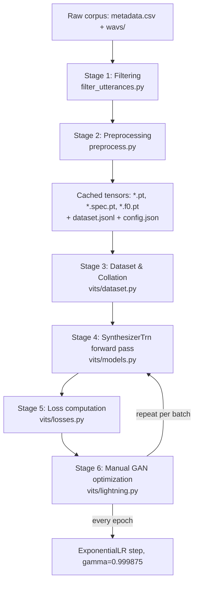
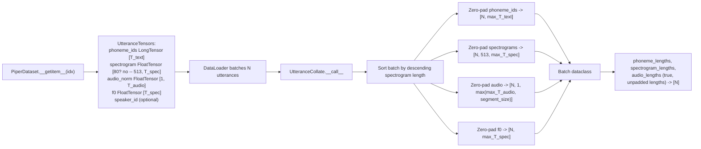
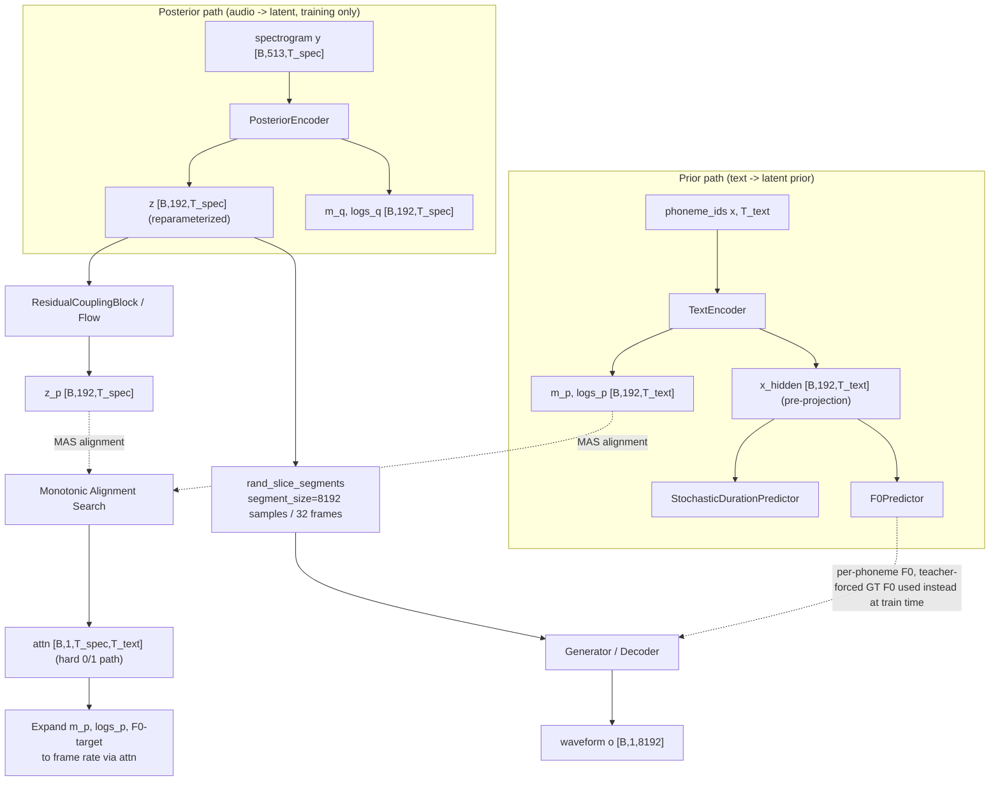
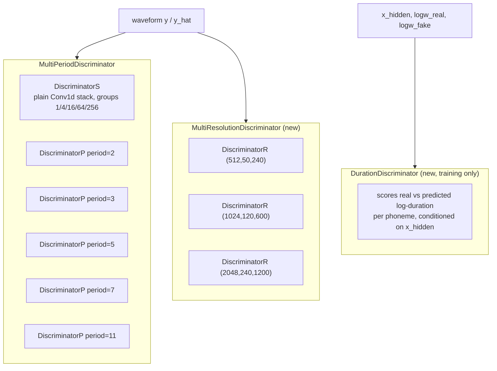
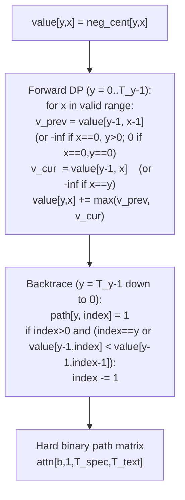
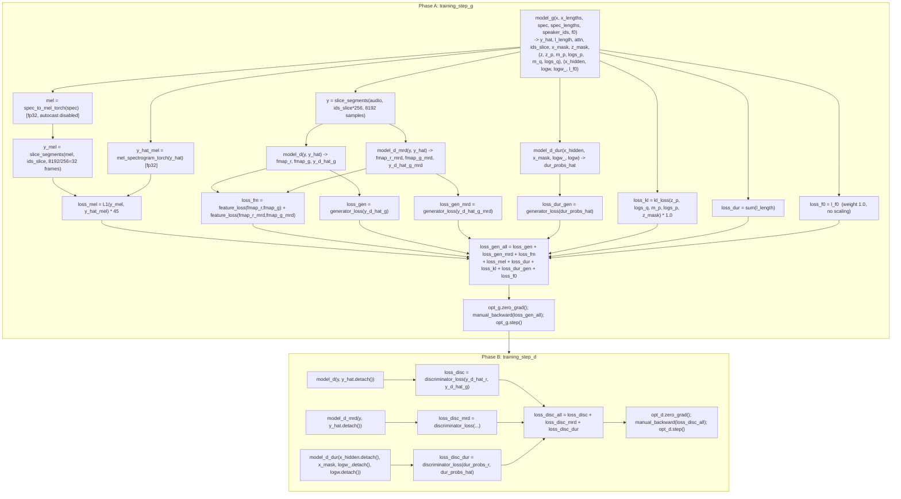
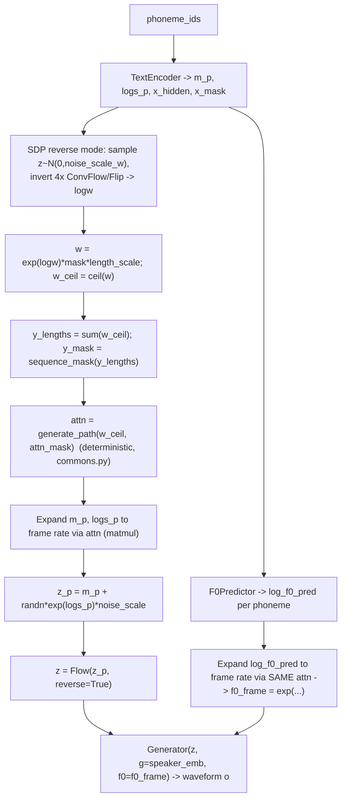

# Piper-Modern: Full Training Pipeline Architecture

This document describes, with algorithmic precision, the complete pipeline implemented in `src/python/piper_train/` — from raw `(text, wav)` pairs on disk to the gradient updates applied at every training step. It is grounded directly in the source code (`preprocess.py`, `filter_utterances.py`, `norm_audio/`, `vits/dataset.py`, `vits/models.py`, `vits/modules.py`, `vits/attentions.py`, `vits/losses.py`, `vits/lightning.py`, `vits/commons.py`, `vits/mel_processing.py`, `vits/monotonic_align/`). All shapes, weights, and hyperparameters below are the actual defaults used by this codebase, not generic VITS values.

Every section includes a Mermaid diagram (renders directly as an image in most Markdown viewers / GitHub / `mermaid.live`) plus the exact tensor shapes and formulas, so it can be redrawn in any external diagramming tool.

---

## 0. System Overview



Two networks are trained adversarially with **manual** (non-automatic) PyTorch Lightning optimization, because GAN training needs two independent `backward()`/`step()` calls per batch (generator, then discriminator) and PyTorch Lightning 2.x removed the old `optimizer_idx` dispatch mechanism:

- **Generator side** (`model_g` = `SynthesizerTrn`): a Conditional VAE (posterior encoder + prior text encoder + normalizing flow) whose decoder is a HiFi-GAN-style upsampling generator, plus a stochastic duration predictor and a new F0 predictor.
- **Discriminator side**: three independent discriminators — `model_d` (Multi-Period Discriminator, waveform domain), `model_d_mrd` (Multi-Resolution STFT Discriminator, new), `model_d_dur` (Duration Discriminator, new, training-only).

---

## 1. Data Pipeline

### 1.1 Stage 1 — Outlier Filtering (`filter_utterances.py`)

Run once, before `preprocess.py`, on the raw `metadata.csv`. Reads `id|text` (or `id|speaker|text`) rows from stdin, computes a **speaking-rate** outlier filter per speaker, and writes the surviving rows to stdout.

```mermaid
flowchart LR
    A[metadata.csv rows] --> B[Locate wav file\nwavs/ or wav/]
    B --> C[ffmpeg: decode to 16kHz mono PCM]
    C --> D[Silero VAD: trim_silence\nthreshold=0.8, chunk=480 samples\nkeep 2 chunks before/after]
    D --> E[duration_sec = speech-only duration]
    E --> F["rate = len(text minus punctuation) / duration_sec"]
    F --> G[Group rates by speaker]
    G --> H["IQR: Q1, Q3 = quartiles(rates, n=4)\nIQR = Q3 - Q1\nlower = Q1 - scale_lower*IQR\nupper = Q3 + scale_upper*IQR"]
    H -->|rate in [lower, upper]| I[Keep row]
    H -->|rate < lower or > upper| J[Exclude: rate_low / rate_high]
```

**Algorithm detail (exact code, `filter_utterances.py:112-131`):**
```
punctuation_pattern = ".。,，?¿？؟!！;；:：-—"
text_nopunct = remove(punctuation_pattern, text)
rate = len(text_nopunct) / duration_sec        # chars per second of actual speech

q1, q3 = statistics.quantiles(rates_for_speaker, n=4)[0], [-1]
iqr = q3 - q1
lower = q1 - scale_lower * iqr      # scale_lower default 2.0
upper = q3 + scale_upper * iqr      # scale_upper default 2.0

exclude if rate < lower  -> ExcludeReason.LOW
exclude if rate > upper  -> ExcludeReason.HIGH
```
Other exclusion reasons applied earlier: `file_missing`, `file_empty` (zero-byte wav).

### 1.2 Stage 2 — Preprocessing (`preprocess.py`)

For every surviving utterance, run in a worker-pool (`multiprocessing`, one process per CPU core by default):

```mermaid
flowchart TB
    A[id, text, wav_path] --> B{phoneme_type}
    B -->|espeak default| C["phonemize_espeak(text, language)\n-> phoneme_ids_espeak()"]
    B -->|text| D["phonemize_codepoints(text)\n-> phoneme_ids_codepoints()"]
    C --> E[phoneme_ids: List[int]]
    D --> E
    A --> F[cache_norm_audio]
    F --> F1["librosa.load at 16kHz"]
    F1 --> F2["Silero VAD trim_silence\nthreshold=0.2, chunk=480\nkeep 2 chunks before/after"]
    F2 --> F3["librosa.load again at target sample_rate (22050 Hz)\noffset=offset_sec, duration=duration_sec"]
    F3 --> F4["audio_norm: FloatTensor [-1,1], shape [1, T_samples]\nsaved as <sha256(path)>.pt"]
    F4 --> F5["spectrogram_torch(n_fft=1024, hop=256, win=1024, center=False)\nshape [513, T_frames]\nsaved as <sha256(path)>.spec.pt"]
    F5 --> G[cache_f0]
    G --> G1["pyworld.dio + pyworld.stonemask\nframe_period_ms = hop/sr*1000 = 11.61 ms"]
    G1 --> G2["_interpolate_unvoiced: linear-interp\nlog-F0 over F0==0 (unvoiced) gaps"]
    G2 --> G3["Truncate/pad (edge mode) to num_mel_frames\n(pyworld is consistently 1 frame longer)"]
    G3 --> G4["f0: FloatTensor [T_frames]\nsaved as <id>.f0.pt"]
    E --> H[Write one JSON line to dataset.jsonl:\nphoneme_ids, audio_norm_path, audio_spec_path,\naudio_f0_path, speaker_id, text]
    F4 --> H
    F5 --> H
    G4 --> H
```

Key exact parameters:
- VAD model: Silero VAD ONNX (`norm_audio/models/silero_vad.onnx`), operates at 16 kHz, `silence_threshold=0.2`, `samples_per_chunk=480`, keeps 2 chunks of context before/after the detected speech boundary.
- Spectrogram: `n_fft=1024`, `hop_length=256`, `win_length=1024`, Hann window, `center=False`, reflect-padded by `(n_fft - hop_length) // 2` on each side before STFT.
- F0: `pyworld.dio` (coarse F0 search) → `pyworld.stonemask` (refinement) → frame period = `hop_length / sample_rate * 1000` ms (11.61 ms at 22050 Hz/256 hop) → log-space linear interpolation fills unvoiced (F0=0) frames → truncated/edge-padded to match the spectrogram's frame count exactly (pyworld's output is always 1 frame longer for this configuration).
- Output config (`config.json`) records: sample rate, espeak voice, phoneme-id map (from `piper_phonemize`), number of symbols, number of speakers, speaker-id map.

### 1.3 Stage 3 — Dataset & Collation (`vits/dataset.py`)



Note: `spectrogram` channel count here is the raw STFT magnitude bin count (`n_fft//2+1 = 513`), **not** mel bins — mel conversion happens later, on-the-fly inside the training step (Section 4). `max_audio_length` is forced to be at least `segment_size` (8192 samples) so `rand_slice_segments` always has a valid window even for very short utterances.

---

## 2. Model Architecture (`vits/models.py`)

The model is `SynthesizerTrn`, a Conditional-VAE + Normalizing-Flow + GAN decoder, with three Piper-Modern additions over stock VITS/Piper: **(a)** Snake1d (BigVGAN-style) + Multi-Resolution STFT Discriminator (UnivNet-style) in the generator/discriminator, **(b)** a Transformer-augmented coupling layer + Duration Discriminator (both VITS2-style) in the flow, **(c)** an explicit F0 Predictor (FastPitch-style per-phoneme pitch conditioning) feeding the decoder.

None of these four mechanisms is individually novel — each has direct prior art (BigVGAN, UnivNet, VITS2, FastPitch). The contribution is **integration-level**: combining a BigVGAN-style generator/discriminator, a VITS2-style flow + duration discriminator, and FastPitch-style per-phoneme pitch conditioning inside one single-speaker, low-resource VITS pipeline — to our knowledge not previously published as one combined system. See `docs/Paper/related-work-spec_sec2.md` for the literature positioning behind this claim.



### 2.1 TextEncoder (`models.py:207-248`)

```
emb = Embedding(n_vocab, hidden_channels=192), init N(0, 192^-0.5)
x = emb(phoneme_ids) * sqrt(192)            # [B, T_text, 192] -> transpose -> [B, 192, T_text]
x_mask = sequence_mask(x_lengths)
x = attentions.Encoder(hidden=192, filter=768, n_heads=2, n_layers=6,
                        kernel_size=3, p_dropout=0.1, window_size=4)(x, x_mask)
stats = Conv1d(192, 192*2, kernel=1)(x)
m_p, logs_p = split(stats, 192, dim=1)       # prior mean / log-std, each [B,192,T_text]
```
`attentions.Encoder` is a 6-layer, 2-head Transformer block (relative-position self-attention, window_size=4) + position-wise FFN, each sub-layer wrapped in residual + LayerNorm (post-norm, VITS-style — not the pre-norm convention).

### 2.2 PosteriorEncoder (`models.py:389-428`)

```
pre  = Conv1d(513, 192, kernel=1)
enc  = WN(hidden=192, kernel=5, dilation_rate=1, n_layers=16, gin_channels)   # WaveNet-style dilated conv stack
proj = Conv1d(192, 192*2, kernel=1)
stats = proj(enc(pre(spec) * mask, mask)) * mask
m_q, logs_q = split(stats, 192, dim=1)
z = (m_q + randn_like(m_q) * exp(logs_q)) * mask     # reparameterization trick
```
Only used during training (the posterior needs the ground-truth spectrogram, unavailable at inference).

### 2.3 Normalizing Flow (`ResidualCouplingBlock` + `TransformerCouplingLayer`, VITS2-style)

4 flow blocks, each = `[TransformerCouplingLayer, Flip]`, alternating which half of the 192 channels is transformed:

```
TransformerCouplingLayer.forward(x, mask):
    x0, x1 = split(x, 96, 96, dim=1)
    h = Conv1d(96->192, k=1)(x0) * mask
    h = WN(hidden=192, kernel=5, dilation=1, n_layers=4)(h, mask)        # WaveNet conditioner
    h = h + attentions.Encoder(hidden=192, filter=384, n_heads=2,
                                n_layers=1, kernel=1)(h, mask)            # NEW: self-attention add-on
    stats = Conv1d(192->96, k=1)(h) * mask     # mean_only=True -> logs is implicitly 0
    m = stats
    x1' = m + x1 * exp(0) * mask = m + x1 * mask   # affine coupling (mean-only in this config)
    return cat(x0, x1'), logdet
```
The docstring in code explicitly notes invertibility is unaffected: `x0` always passes through unchanged, so adding the attention pass only changes *how expressively* the affine parameters of `x1` are computed — the inverse (`reverse=True`, `x1 = (x1-m)*mask`) still exactly undoes the forward pass. Verified empirically (forward→reverse reconstructs input even after randomly perturbing weights).

### 2.4 Stochastic Duration Predictor (SDP, `use_sdp=True` default)

A duration model based on its own pair of conditional normalizing flows (one to model the duration likelihood `nll`, one auxiliary flow `logq` to make duration a continuous latent variable rather than a deterministic regression):
```
x = detach(x_hidden); x = pre(x); x = DDSConv(filter=192, kernel=3, layers=3)(x)
x = proj(x) * mask                                   # conditioning features h_text
# --- training direction (reverse=False) ---
h_w = post_pre(w) -> post_convs(DDSConv) -> post_proj      # w = true MAS duration counts [B,1,T_text]
z_q = randn[B,2,T_text]; apply 4x [ElementwiseAffine/ConvFlow, Flip] conditioned on (h_text + h_w)
z_u, z1 = split(z_q, 1, 1); u = sigmoid(z_u)*mask; z0 = (w - u)*mask
logq = sum(-0.5*(log(2*pi) + e_q^2)*mask) - logdet_tot_q
z = cat(log(z0), z1)   # via modules.Log flow
apply 4x [ConvFlow, Flip] (+leading ElementwiseAffine) conditioned on h_text, reverse=False
nll = sum(0.5*(log(2*pi) + z^2)*mask) - logdet_tot
l_length = (nll + logq)            # per-utterance scalar, then summed/normalized by sum(x_mask)
```
Each `ConvFlow` is a piecewise-rational-quadratic-spline coupling transform (10 bins, tail_bound=5.0, linear tails) — the same spline-flow family used by SDP in upstream VITS.

At inference (`reverse=True`): sample `z ~ N(0, noise_scale_w)`, run the 4 `ConvFlow`/`Flip` pairs backward, take `logw = z0` as the predicted log-duration per phoneme.

### 2.5 F0 Predictor (FastPitch-style per-phoneme pitch conditioning, `models.py:168-204`)

Architecturally identical to the (non-stochastic) `DurationPredictor` — same 2-conv + LayerNorm + ReLU + dropout stack — but regresses a scalar **log-F0** per phoneme instead of log-duration. This per-phoneme-average-pitch-from-encoder-hidden-state mechanism mirrors FastPitch (Łańcucki, 2020); what's new here is feeding it into a VITS2-style flow-based decoder rather than FastPitch's non-autoregressive FFTr decoder — see `docs/Paper/related-work-spec_sec2.md`.
```
F0Predictor(in=192, filter=256, kernel=3, p_dropout=0.5):
    x = detach(x_hidden)
    x = ReLU(LayerNorm(Conv1d(192,256,k=3)(x*mask)));  dropout
    x = ReLU(LayerNorm(Conv1d(256,256,k=3)(x*mask)));  dropout
    log_f0_pred = Conv1d(256,1,k=1)(x*mask) * mask        # [B,1,T_text]
```
**Training target derivation** (the precise, non-obvious part — `models.py:975-984`): the ground-truth frame-rate F0 contour is averaged over the *MAS-aligned* frames belonging to each phoneme, using the same hard alignment matrix `attn` produced for duration:
```
attn_sq      = attn.squeeze(1)                          # [B, T_spec, T_text] hard 0/1 path
f0_frame     = f0[:, :T_spec].unsqueeze(1)               # [B, 1, T_spec] ground-truth F0
phone_f0_sum = matmul(f0_frame, attn_sq)                  # [B, 1, T_text] sum of F0 over aligned frames
phone_f0     = phone_f0_sum / clamp_min(w, 1.0)           # w = per-phoneme frame count -> mean F0
log_f0_target = log(clamp_min(phone_f0, 1.0)) * x_mask
l_f0 = sum((log_f0_pred - log_f0_target)^2 * x_mask) / sum(x_mask)   # masked MSE
```
At inference time there is no ground truth, so the *predicted* per-phoneme log-F0 is expanded to frame rate using the same predicted alignment used for `m_p`/`logs_p` (`models.py:1063-1067`), then exponentiated and fed to the decoder.

### 2.6 Generator / Decoder (BigVGAN-style Snake1d + F0/speaker conditioning, `models.py:431-522`)

```
conv_pre: Conv1d(192, 256, kernel=7, padding=3)
x = conv_pre(z_slice)
x = x + cond(g)            if multi-speaker (gin_channels>0)
x = x + f0_cond(f0_slice)  # f0_cond: Conv1d(1,256,k=1), ZERO-initialized weight+bias
                            # -> exact no-op when grafted onto a checkpoint that predates F0 conditioning
for stage i in 0..2 (upsample_rates = (8, 8, 4)):
    x = Snake1d(channels_i)(x)              # pre_up_snakes[i], channels_i = 256/(2^i)
    x = ConvTranspose1d(channels_i -> channels_i/2, kernel=upsample_kernel_sizes[i], stride=upsample_rates[i],
                         padding=(k-u)//2, weight_norm)(x)
    xs = sum over 3 ResBlock2(channels_i/2, kernel in {3,5,7}, dilation in {(1,2),(2,6),(3,12)})(x)
    x  = xs / 3                              # average of the 3 parallel resblocks
x = Snake1d(32)(x)                            # final_snake, channels = 256/2^3 = 32
x = Conv1d(32, 1, kernel=7, padding=3, bias=False)(x)
o = tanh(x)                                   # waveform in [-1, 1], shape [B, 1, 8192]
```
`Snake1d(x) = x + (1/(alpha+eps)) * sin(alpha*x)^2`, with a learnable per-channel `alpha` (BigVGAN). It replaces the LeakyReLU activations used by stock HiFi-GAN/Piper generators, on the premise that a periodic inductive bias suits raw waveform synthesis. `ResBlock2` (selected because `resblock="2"` is the default) has 2 (Snake → weight-normed dilated Conv1d) sub-blocks per residual unit, vs. `ResBlock1`'s 3. Total upsample factor = 8×8×4 = 256 = `hop_length`, so the 32-frame latent segment (`segment_size // hop_length`) becomes exactly 8192 waveform samples.

### 2.7 Discriminators



- **DiscriminatorP** reshapes the 1D waveform into a 2D `[T/period, period]` grid (reflect-padded if needed) and applies 2D convolutions with `(kernel,1)` filters — channel progression 1→32→128→512→1024→1024, `LeakyReLU(0.1)`, weight-normalized (or spectral-normalized) convs.
- **DiscriminatorS** is the same idea without periodicity (grouped 1D convs, groups 1/4/16/64/256, kernel 41 mostly).
- **DiscriminatorR** (new, UnivNet-style, `models.py:743-799`): computes `|STFT(y)|` at one fixed `(n_fft, hop, win)` resolution (explicitly forced to run in fp32 — `torch.autocast(..., enabled=False)` — because cuFFT does not support half/bf16), treats the magnitude spectrogram as a 2D image, and applies 5 `Conv2d` layers (channels 1→32→32→32→32→32, kernels `(3,9)`/`(3,3)`, strides `(1,2)` on 3 of them) + a `(3,3)` head. Three independent instances at resolutions `(512,50,240)`, `(1024,120,600)`, `(2048,240,1200)` form the `MultiResolutionDiscriminator`, sharing the exact `(y_d_rs, y_d_gs, fmap_rs, fmap_gs)` interface as `MultiPeriodDiscriminator` so the same loss functions apply unchanged.
- **DurationDiscriminator** (new, VITS2-style, `models.py:668-740`, training-only — dropped before export/inference): a small conv+LayerNorm stack encodes `x_hidden` (detached) to a feature map, projects the duration scalar (`dur_proj: Conv1d(1, filter)`) and concatenates it with the text features, then a `Conv→Conv→Linear→Sigmoid` head scores **each phoneme position** (`[B, T_text, 1]`) as real (ground-truth MAS duration `logw_`) vs. fake (SDP-sampled `logw`).

---

## 3. Monotonic Alignment Search (MAS)

MAS finds the optimal hard, monotonic, non-skipping alignment between `T_text` phonemes and `T_spec` frames — replacing external duration labels (forced alignment / MFA) entirely. It runs under `torch.no_grad()` every training step.

### 3.1 Score matrix: negative cross-entropy between prior and posterior-flow

For a Gaussian prior `N(m_p, exp(2*logs_p))` per phoneme and the flow-mapped posterior sample `z_p`, the negative cross-entropy at every `(text position, frame)` pair (`models.py:948-963`) is:
```
s_p_sq_r  = exp(-2 * logs_p)                                              # [B, 192, T_text]
neg_cent1 = sum_d( -0.5*log(2*pi) - logs_p )                               # [B, 1, T_text]
neg_cent2 = matmul( -0.5 * z_p^2.transpose(1,2), s_p_sq_r )                # [B, T_spec, T_text]
neg_cent3 = matmul( z_p.transpose(1,2), m_p * s_p_sq_r )                   # [B, T_spec, T_text]
neg_cent4 = sum_d( -0.5 * m_p^2 * s_p_sq_r )                               # [B, 1, T_text]
neg_cent  = neg_cent1 + neg_cent2 + neg_cent3 + neg_cent4                  # [B, T_spec, T_text]
```
This is algebraically `log N(z_p[t]; m_p[s], exp(2*logs_p[s]))` for every frame `t` against every text position `s`, expanded to avoid recomputing the quadratic term per pair.

### 3.2 Dynamic program (`monotonic_align/core.pyx`)

Given the `[T_y, T_x]` score matrix `value` (`T_y` = frames, `T_x` = text positions), find the monotonic path of frame→phoneme assignments maximizing total score. Implemented as a Cython kernel, parallelized over the batch with `prange`:



Intuition: `value[y, x]` accumulates the best cumulative alignment score for having consumed text positions `0..x` by frame `y`, under the constraint that text position only ever advances forward (monotonic, no skipping backward) and never skips a text unit (each text unit must be assigned ≥1 contiguous frame block once reached). The backward pass reconstructs the arg-max path. The result `attn` is a binary `[T_spec, T_text]` matrix where each frame is assigned to exactly one phoneme, and phoneme assignment is contiguous and increasing.

`w = attn.sum(dim=2)` then gives the **integer duration** (frame count) of each phoneme — this is the supervision target for both the Stochastic Duration Predictor (`l_length`) and, via per-phoneme F0 averaging, the F0 Predictor (`l_f0`).

---

## 4. Training-Step Computation Graph (`lightning.py:237-383`)

Manual optimization, two sequential phases per batch (`training_step`, `lightning.py:216-227`): **generator phase fully completes (forward+backward+step) before discriminator phase begins**, reusing the generator's cached outputs (`self._y`, `self._y_hat`, `self._dur_*`).



### 4.1 Exact loss formulas (`vits/losses.py`)

| Loss | Formula | Where used |
|---|---|---|
| `discriminator_loss(real, fake)` | `Σ_scales [ mean((1-D(real))²) + mean(D(fake)²) ]` (LSGAN) | MPD, MRD, DurationDiscriminator (D-phase) |
| `generator_loss(fake)` | `Σ_scales mean((1-D(fake))²)` | MPD, MRD, DurationDiscriminator (G-phase, adversarial term) |
| `feature_loss(fmap_r, fmap_g)` | `2 · Σ_layers mean(\|fmap_r - fmap_g\|)` (real detached) | MPD + MRD intermediate-feature matching |
| `kl_loss(z_p, logs_q, m_p, logs_p, mask)` | `Σ [ logs_p - logs_q - 0.5 + 0.5·(z_p-m_p)²·exp(-2·logs_p) ]·mask / Σmask` | VAE KL term, posterior‖flow(prior) |
| `l_length` (SDP) | `(nll + logq) / Σx_mask`, from the SDP's own normalizing-flow NLL (Section 2.4) | Duration loss |
| `l_f0` | masked MSE in log-F0 space (Section 2.5) | F0 loss |
| `loss_mel` | `L1(mel(y), mel(ŷ)) · c_mel`, `c_mel=45` | Reconstruction / spectral loss |

### 4.2 Total objectives

```
loss_gen_all  = loss_gen        (MPD adversarial)
              + loss_gen_mrd    (MRD adversarial, new)
              + loss_fm         (MPD+MRD feature matching)
              + loss_mel        (×45)
              + loss_dur        (SDP NLL+logq)
              + loss_kl         (×1.0)
              + loss_dur_gen    (DurationDiscriminator adversarial, new)
              + l_f0            (×1.0, new)

loss_disc_all = loss_disc       (MPD)
              + loss_disc_mrd   (MRD, new)
              + loss_disc_dur   (DurationDiscriminator, new)
```
Every individual term is also logged separately (`self.log(...)`) specifically so that `loss_mel`, `loss_kl`, `loss_dur`, `loss_gen`, `loss_fm`, `loss_disc` remain directly comparable against a baseline (non-Modern) Piper run that lacks the MRD/duration-discriminator/F0 terms.

### 4.3 Mixed-precision caveat

`torch.stft` (used inside `mel_spectrogram_torch`, `spec_to_mel_torch`, and `DiscriminatorR.spectrogram`) relies on cuFFT, which does not support half/bf16 tensors. All STFT-touching code paths explicitly wrap themselves in `torch.autocast(..., enabled=False)` and cast to `.float()` first, even when the surrounding training step otherwise runs under autocast mixed precision.

---

## 5. Optimization (`configure_optimizers`, `lightning.py:411-440`)

```mermaid
flowchart LR
    G[model_g.parameters()] --> OG["AdamW(lr=2e-4, betas=(0.8,0.99), eps=1e-9)"]
    D1[model_d.parameters()] --> CH[itertools.chain]
    D2[model_d_mrd.parameters()] --> CH
    D3[model_d_dur.parameters()] --> CH
    CH --> OD["AdamW(lr=2e-4, betas=(0.8,0.99), eps=1e-9)"]
    OG --> SG["ExponentialLR(gamma=0.999875)\nstepped once per epoch"]
    OD --> SD["ExponentialLR(gamma=0.999875)\nstepped once per epoch"]
```
Two independent AdamW optimizers (generator vs. the three discriminators jointly), each with its own `ExponentialLR(gamma=0.999875)` scheduler. Because `automatic_optimization=False`, the schedulers are **not** auto-stepped by Lightning — `on_train_epoch_end` (`lightning.py:229-235`) manually calls `.step()` on both once per epoch, replicating PL 1.7's default cadence.

---

## 6. Hyperparameter Reference (defaults, `lightning.py:27-83`)

| Group | Parameter | Value |
|---|---|---|
| Audio | `sample_rate` | 22050 Hz |
| Audio | `filter_length` / `win_length` | 1024 |
| Audio | `hop_length` | 256 |
| Audio | `mel_channels` | 80 |
| Model | `inter_channels` (latent dim) | 192 |
| Model | `hidden_channels` | 192 |
| Model | `filter_channels` (FFN width) | 768 |
| Model | `n_heads` / `n_layers` (TextEncoder) | 2 / 6 |
| Model | `resblock` | "2" → `ResBlock2` |
| Model | `resblock_kernel_sizes` | (3, 5, 7) |
| Model | `resblock_dilation_sizes` | ((1,2), (2,6), (3,12)) |
| Model | `upsample_rates` | (8, 8, 4) → 256× total = hop_length |
| Model | `upsample_initial_channel` | 256 |
| Model | `upsample_kernel_sizes` | (16, 16, 8) |
| Model | `use_sdp` | True |
| Train | `segment_size` | 8192 samples (32 mel frames) |
| Train | `learning_rate` | 2e-4 |
| Train | `betas` | (0.8, 0.99) |
| Train | `eps` | 1e-9 |
| Train | `lr_decay` (ExponentialLR gamma) | 0.999875 |
| Train | `c_mel` | 45 |
| Train | `c_kl` | 1.0 |
| Train | `batch_size` (CLI default) | 8 — "tuned for a 12 GB GPU (RTX 4070 Ti)" |
| Train | `max_phoneme_ids` (CLI default) | 400 |
| Train | `validation_split` | 0.1 |
| Train | `num_test_examples` | 5 |

---

## 7. Inference-Time Flow (`SynthesizerTrn.infer`, `models.py:1023-1075`)

Differs from training in that there is no ground-truth audio, so duration and F0 are both *predicted* and the hard alignment is *generated* deterministically rather than searched via MAS.


`generate_path` (`commons.py:116-129`) builds the same kind of binary monotonic path as MAS, but directly from a duration count rather than by searching — it computes a cumulative-sum sequence mask and differences it to get per-phoneme frame spans, deterministically (no dynamic programming needed since durations are already given).

Default inference scales (from preprocessing `config.json`): `noise_scale=0.667`, `length_scale=1`, `noise_w=0.8`.
